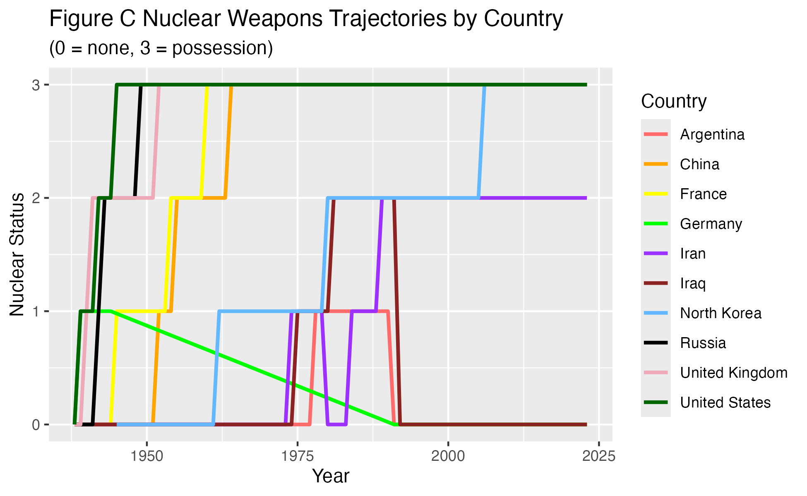

## Introduction 

Within the nuclear weapons club, precarious leaders can make some of the world's most instantaneous defense decisions. This project examines whether authoritarian or democratic regimes are more likely to pursue nuclear weapons programs. I examine this question through also understanding whether regime type alone may be why a country pursues nuclear weapons. It is important to understand this relationship because nuclear proliferation, especially today, poses major risk internationally.

In an international system where the U.S. and Russia are almost head-to-head with their nuclear stockpile, democratic nations largely possess more nuclear arsenals in the post-Cold War landscape than authoritarian regimes all together. This is shaped by decades of competition, such as the Cuban Missile Crisis, and ongoing security concerns. However, China is now on the rise, expanding its arsenal faster than any other country. Meanwhile, several countries, including Ukraine, South Africa, and Argentina, voluntarily gave up their nuclear pursuit in the 1990s, raising the question on whether regime type may determine nuclear capabilities as mentioned above. 

In general, democratic governments are more likely to be beholden to public accountability and legislative oversight, allowing more transparency, supervising and monitoring of activities the President conducts. These constraints can limit excessive military spending and raise the political cost of pursuing large nuclear arsenals. Conversely, authoritarian governments have fewer domestic constraints due to censorship (news accountability, take North Korea for example) or have a personalist dictator (Russia). A regime like this then may be able to leverage absolute  military power as a means to brand nuclear determination as regime survival. 

#### Therefore my research question is: Are democratic or authoritarian regimes more likely to pursue nuclear weapons programs? ####

## Data 

#### Hypothesis: ####

Authoritarian countries are more likely than democratic countries to pursue nuclear weapons programs.

#### Variables 

This study uses cross-sectional time-series observational data.

My explanatory variable is regime type. This variable is measured by Our World Data on political regimes, which organizes countries on a scale of 0-3 to range autocracies and liberal democracies. I've recorded this into a binary variable where countries with values of 2 or higher are liberal democracies and are coded as 1, and autocracies are coded with values of 1 or lower as 0. 

My outcome variable is whether a country is pursuing a nuclear weapons program in a given year. This is measured using an Our World in Data dataset where:
0 = not considering; 1 = considering; 2 = pursuing; 3 = possessing

A pattern in the data that would support my hypothesis would be if autocratic countries, coded with a 0, are more likely to have a nuclear program than countries with a 1. My hypothesis will be disproved if democratic and authoritarian regimes pursue nuclear programs at similar rates, or if democratic countries are more likely to pursue nuclear weapons programs than authoritarian ones. 


```{r, echo = F}
library(readr)
library(dplyr)
library(tidyverse)
```

```{r, echo = F}
nuclear_data <- read_csv("Data/country-position-nuclear-weapons.csv", show_col_types = FALSE) |>
  rename(nuclear_status = status) |>
  mutate(
    nuclear_program = ifelse(nuclear_status >= 2, 1, 0)
  )
knitr::kable(head(nuclear_data))

```

```{r, echo = F}

democracy_data <- read_csv("Data/political-regime.csv")


knitr::kable(head(democracy_data))
```

#### Data cleaning 

```{r, echo = F}
democracy_data <- democracy_data |>
  rename(regime = regime_row_owid)


```

```{r, echo = F}
democracy_data <- democracy_data |>
  mutate(
    regime_binary = case_when(
      regime >= 2 ~ 1,   
      regime <= 1 ~ 0    
    ))

nuclear_data <- nuclear_data |>
  mutate(
    nuclear_program = ifelse(nuclear_status >= 2, 1, 0)
  )
```

```{r, echo = F}
combine_data <- democracy_data |>
  inner_join(nuclear_data, by = c("code", "year"))

```

## Results

#### Figure A Bar Plot 

```{r, echo = F}
plot_data <- combine_data |>
  group_by(regime_binary) |>
  summarize(
    prop_nuclear = mean(nuclear_program, na.rm = TRUE)
  )


bar <- ggplot(plot_data, aes(x = factor(regime_binary), y = prop_nuclear, fill = factor(regime_binary))) +
  geom_col(width = 0.5) +
  geom_text(aes(label = round(prop_nuclear, 2)), vjust = -0.5) +
  scale_x_discrete(labels = c("Authoritarian", "Democracy")) +
  scale_fill_manual(
    values = c("0" = "indianred1", "1" = "steelblue1"),
    labels = c("Autocracy", "Democracy"),
    name = "Regime Type"
  ) +
  labs(
    title = "Figure A Democracies vs Authoritarian nuclear weapons",
    subtitle = "Proportion of country-years pursuing or possessing nuclear weapons",
    x = "Regime Type",
    y = "Proportion"
  ) 

ggsave("bar.png", plot = bar)

```


This visualization serves as a broad overview. Each observation in the data sets represents a country in a specific year and the proportions in the graph reflect how often countries of each regime type have nuclear weapons across all observed years. Democratic countries show a higher proportion of weapons, sitting at 8%, compared to autocratic countries which are at 4%. Therefore, democratic regimes are about twice as likely as autocracies to pursue or possess nuclear weapons based on this graph.


Note: Only 749 out of almost 21,000 country-year observations involve nuclear weapons, making the sample extremely low. Most countries do not pursue or possess nuclear weapons during most observed years. 


#### Figure B Time Trend Plot

```{r, echo = F}
overtime_data <- combine_data |>
  group_by(year, regime_binary) |>
  summarize(
    prop_nuclear = mean(nuclear_program, na.rm = TRUE)
  )

time_plot <- ggplot(overtime_data, aes(x = year, y = prop_nuclear, color = factor(regime_binary))) +
  geom_line() +
  scale_color_manual(
    values = c("0" = "indianred1", "1" = "steelblue1"),
    labels = c("Autocracy", "Democracy"), name = "Regime Type" ) +
  labs(
    title = "Figure B Nuclear weapons pursuit over time by regime type",
    x = "Year",y = "Proportion Pursuing/Possessing")


ggsave("time_plot.png", plot = time_plot)
```


This visualization shows that democratic countries had a higher proportion of nuclear weapon programs from the 1940s to the 1960s where the proportion sits at nearly 20%. The data is structured by country-year, this means that about 20% of democratic country-year observations (or 1 in 5 democratic countries in a given year) were pursuing or possessing nuclear weapons during this period. This pattern reflects the early nuclear development of countries such as the U.S., U.K., and France during and immediately after WWII (~1945) to prevent the spread of proliferation to other countries and have defense against the Soviet Union.

This gap has changed however. From the 1970s onward, the proportion of democratic countries pursuing or possessing nuclear weapons slowed down, whereas authoritarian regimes steadily increased pursuit or possession. By the 1990s and 2000s, the two regime types overlap, and in some years following authoritarian regimes actually overcome democracies in nuclear possession or pursuit. This is likely due to the end of the Cold War (1947-1991) where democracies stopped expanding and autocracies felt the gradual need to rely on mutually assured deterrence including North Korea, Pakistan, and Iran.

Although democracies were historically more likely to develop nuclear weapons and may possess more today, autocracies have become more active in the nuclear-sphere. Therefore my initial interpretation is slightly incorrect based on this graph. The reason why democracies appear more likely to possess or pursue nuclear weapons is driven by historical context rather than a consistent pattern drawn into contemporary politics. 

#### Figure C Nuclear Weapon and Country Trajectory 

Since the relationship between regime type and nuclear weapons program seems to depend more on other factors, the next two visualizations demonstrate other motivations to why a country may develop nuclear weapons. 


```{r, echo = F}
selected_countries <- combine_data |>
  filter(entity.x %in% c(
    "Argentina", "China", "France", "Germany", "Iran",
    "Iraq", "North Korea", "Russia", "United Kingdom", "United States")) |>
  mutate(
    entity.x = factor(entity.x, levels = c(
      "Argentina", "China", "France", "Germany", "Iran",
      "Iraq", "North Korea", "Russia", "United Kingdom", "United States")))

weapons_trajec <- ggplot(
  selected_countries,
  aes(x = year, y = nuclear_status, color = entity.x)
) +
  geom_line(linewidth = 1) +
  scale_color_manual(values = c(
    "Argentina" = "indianred1",
    "China" = "orange",
    "France" = "yellow1",
    "Germany" = "green",
    "Iran" = "purple1",
    "Iraq" = "brown4",
    "North Korea" = "steelblue1",
    "Russia" = "black",
    "United Kingdom" = "pink2",
    "United States" = "darkgreen"
  )) + labs( title = "Figure C Nuclear Weapons Trajectories by Country",
    subtitle = "(0 = none, 3 = possession)",
    x = "Year", y = "Nuclear Status", color = "Country")

ggsave("weapons_trajec_image.png", plot = weapons_trajec)
```


For this visualization, I picked three democracies that have nuclear weapons (U.S., France, and the U.K.) and two democracies (Germany and Argentina) that could pursue a nuclear program but has not or discontinued the pursuit. Conversely, I chose three authoritarian countries that have a nuclear program (Russia, China, and North Korea) and two (Iran and Iraq) which have pursued or actively are pursuing a nuclear program but have not achieved proliferation. These countries were selected to show variation in nuclear trajectories across regime types since both regime groups have some successful acquisition, abandonment, or failure despite technological capability. 

Very early, the U.S., U.K., France, and Russia reached status 3, or possession as discussed above. China, North Korea, Iran, and Iraq have later nuclear trajectories in the contemporary era. Germany is especially interesting since after WWII the country went through a process of demilitarization and NATO dependence around 1955. Now they are under the nuclear umbrella of Britain and France to deter any potential Russian aggression. Additionally, after the Fukushima 2011 nuclear meltdown disaster in Japan, their former Chancellor Angela Merkel mandated a nuclear phase-out contributing to concern behind nuclear technology. 

Moreover, Argentina is very compelling since they considered pursuing nuclear weapons but stopped in the 1980s and 1990s due to a process of democratization and desire to forge peaceful relations with their rival Brazil. This shows how potentially having a nuclear weapons program can be seen as unstable and internationally isolating, another reason why democracies may be pursuing less weapons today while authoritarian countries feelthe need to have them with less diplomatic alliances.

Iran is a country that has been attempting to pursue a nuclear program since the 1970s under the Shah. First, the country received assistance through Eisenhower's "Atom for Peace" program, before the U.S. became increasingly wary that Tehran wanted a nuclear weapon. Thus overtime Washington has carried out a series of CIA and overt attacks against their facilities, and sanctioned leaders. However, it's visible in this chart that Tehran's desire to obtain a weapon only grew due to the ambition for regime survival in the Middle East especially in light of the nuclear monopoly Israel has. Iraq also began pursuing weapons in the 1970s and had the technology capable to. This pursuit collapsed by the 1990s under the Bush administration's Gulf War and international pressure, terminating any appetite Baghdad had a weapon for the foreseeable future.  

Lastly, North Korea's development was shaped by deterrence against the U.S. and South Korea, as well as weak alliances after the USSR collapsed in 1991, leading them to possess a weapon by 2009. These examples demonstrates how authoritarian governments under security pressure may develop weapons when regime survival is under threat. For democratic countries it was Cold War competition against the Soviets or industrial/scientific prestige. Overall, pursuing nuclear weapons is not only based on regime type or historical time period, but also political confounders . 

Note: Reminder I've turned my data into binary variables where countries with values of 2 or higher are liberal democracies and are coded as 1, and autocracies are coded with values of 1 or lower as 0. My outcome variable, whether a country is pursuing a nuclear weapons program in a given year is measured where 0 = not considering; 1 = considering; 2 = pursuing; 3 = possessing. 

Let's take India and Pakistan for another more specific example. 

#### Figure D India and Pakistan Case

```{r, echo = F}
selected_countries <- combine_data |>
  filter(entity.x %in% c(
    "India", "Pakistan"
  ))

India_Pakistan <- ggplot(selected_countries, aes(x = year, y = nuclear_status, color = entity.x)) +
  geom_line(linewidth = 1) +
  labs(
    title = "Nuclear Weapons Trajectories by Country",
    subtitle = "(0 = none, 3 = possession)",
    x = "Year",
    y = "Nuclear Status",
    color = "Country"
  )

ggsave("India_Pakistan.png", plot = India_Pakistan)
```


India and Pakistan's nuclear arsenals were compiled much less because of regime type, but primarily because of regional competition. India's early pursuit was shaped by China's rise after the 1962 Sino-Indian War while Pakistan's accelerated in response to military humiliation like the 1971 war, the A.Q. Khan Network, and continual border disputes with India that sparked wars in 1965 and 1999. This shows the complexity behind the causal relationship between the outcome and explanatory variable, especially since regime survival is more important to observe than the regime-type itself for many cases. 

## Regression Analysis

For my regression analysis, I am testing whether regime type is connected with the probability of a country pursuing or possessing nuclear weapons. This will allow me to evaluate the statistical link between my explanatory and outcome variable, and see if the potential confounding factors I have set the stage for above truly play a substantial role in explaining proliferation.  

#### Null hypothesis:

There is no relationship between regime type and the probability of pursuing or possessing nuclear weapons.

#### Alternative hypothesis: 

There is a relationship between regime type and the probability of pursuing or possessing nuclear weapons. 


```{r, echo = F}
model1 <- lm(nuclear_program ~ regime_binary, data = combine_data)
confint(model1)
summary(model1)

knitr::kable(round(summary(model1)$coefficients, 3),
      col.names = c("Estimate", "Std. Error", "t value", "p-value"),
      caption = "Linear Regression: Effect of regime type on nuclear programs")

```


#### Intercept #### 

The regression results estimate the relationship between regime type the likelihood of pursuing or possessing nuclear weapons. The intercept is about 0.039 which shows that autocratic countries have about a 3.9% predicted probability of pursuing or possessing a nuclear weapons program.

#### Coefficient ####

The estimated coefficient is 0.039. This means that democratic countries are approximately 3.9 percentage points more likely to pursue or possess nuclear weapons compared to their autocratic counterparts.The coefficient also has a standard error of 0.004. This means the estimate is fairly accurate or precise since it has a narrow margin of error. 

#### P-Value and Substantive Effect ####

This effect is statistically significant because the P-value is 0, illustrating that the relationship is highly unlikely to be due to random chance. This means the the null hypothesis is rejected and there is a relationship between regime type and nuclear weapons programs. Furthermore, the 95% confidence interval for the coefficient ranges from 3.2 to 4.7 percentage points and does not include zero, which provides more concrete evidence against the null.

However, the substantive effect remains relatively small because the R-squared value is 0.0068 which indicates that regime type alone only explains less than 1% of the variation in nuclear weapons development. This means the other factors, such as regional rivalries or shift to democracies, play a bigger role. 

Altogether Democratic countries are only slightly more likely than authoritarian regimes to pursue or possess nuclear weapons when averaged across all country-years.

#### Can we interpret this relationship as causal?

No, this relationship should not be interpreted as causal because this test relies on observational cross-sectional country-year data. There are other confounding factors I showed through my visualizations particularly the India and Pakistan case. Alliances like NATO, economic development, sanctions, or historical periods could also influence both regime types and nuclear weapons behavior. This means I cannot say with certainty regime type itself directly causes countries to pursue nuclear weapons even if regime type is correlated with nuclear weapons programs. 

## Conclusion 

The results provide only partial support for my original hypothesis. While authoritarian regimes are not more likely than democracies to pursue nuclear weapons programs overall, the data suggests that authoritarian states have become increasingly more active in nuclear proliferation over time. Democratic countries historically dominated nuclear development, particularly before and during the Cold War which heavily influences the findings. Additionally, looking at specific countries, it is clear some countries may have been authoritarian while pursuing a weapon such as Argentina, but transitioned to a democracy. Or, authoritarian countries such as India or Pakistan, wanted to pursue weapons less because of their regime and more based on real wars happening at the time, pushing the need for security. What started as a project on simply regime type and nuclear weapon programs, as revealed that the relationship between the two is constructed not only by domestic political leadership by also by historical context, which cannot be omitted.

As explained above, this project relies on observational country-year data, the findings should not be interpreted causally, and  confounding variables discussed remain very important limitations to this research question. Future research could improve this analysis by incorporating additional explanatory variables such as GDP per capita, military expenditures, Threat on the Non-Proliferation (NPT) membership, the nuclear umbrella states, and nuclear rivalry. This would provide more depth in focusing on historical evolution in nuclear proliferation. Moreover, case-by-case analysis would allow for comparison at a more detailed level. 

Lastly, existing nuclear powers may no longer want to expand their arsenals at this time due to the NPT, mutual assured destruction, moratoriums, or other threats such as UN sanctions. Both the U.S. and Russia maintain large nuclear stockpiles but are constrained by global deterrence structures even if the START treaty has ended. This stagnation among nuclear club powers may make newer nuclear pursuits by emerging or current authoritarian states such as Iran more important than aggregate possession rates alone. 


AI DISCLAIMER: 

For figure C, I used artificial intelligence to help design the ggplot, specifically helping me set up the entity.x variable and figuring out way to organize colors. Both datasets had a country-name column called "entity" and I joined them together. Entity.X is the country name from freedom_data or the left side of join. 

```{r print-code, ref.label=knitr::all_labels(), echo=TRUE, eval=FALSE}
```
