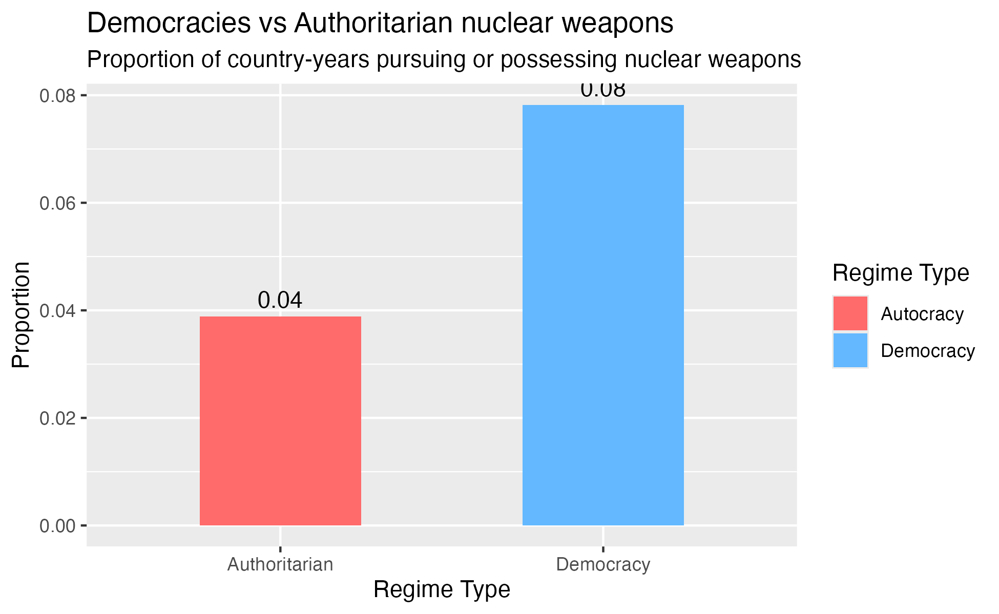
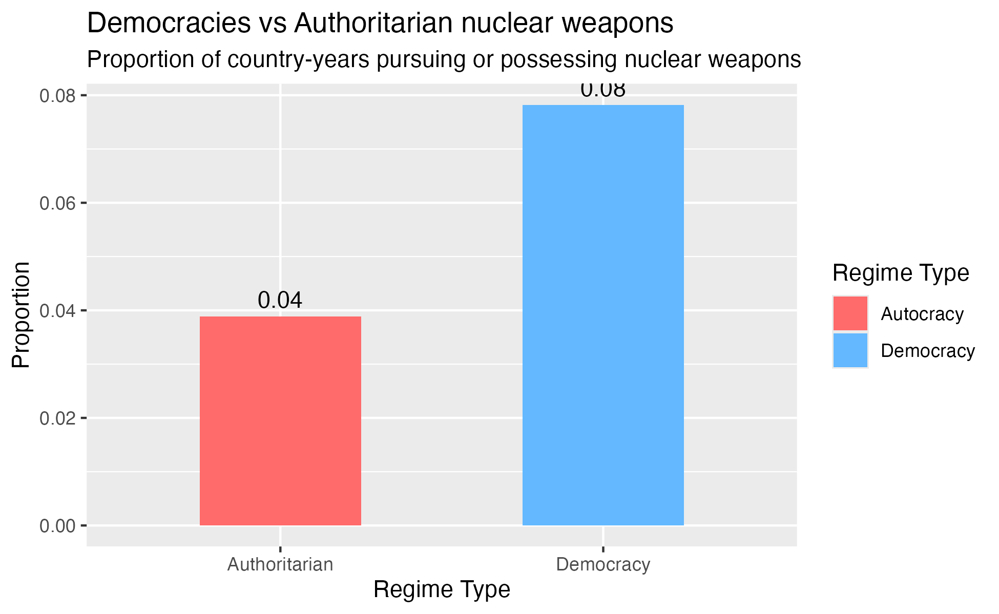
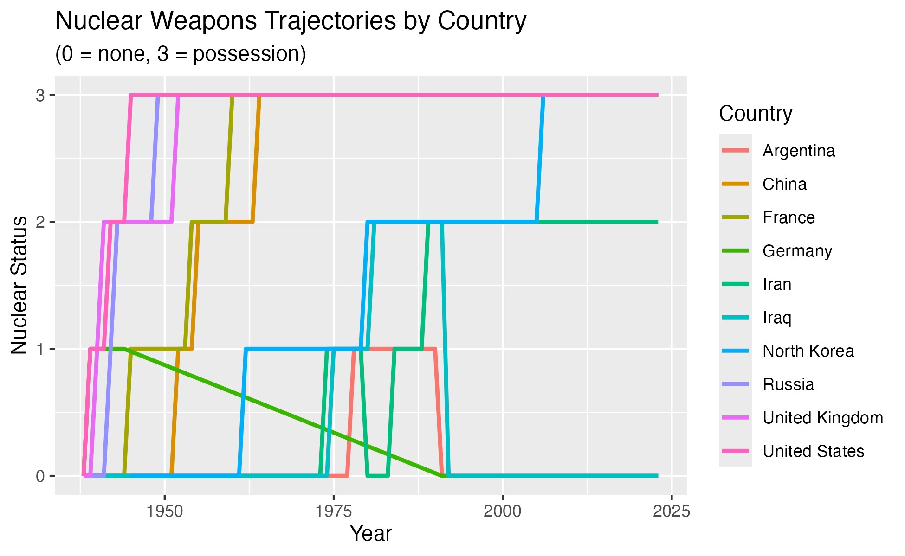
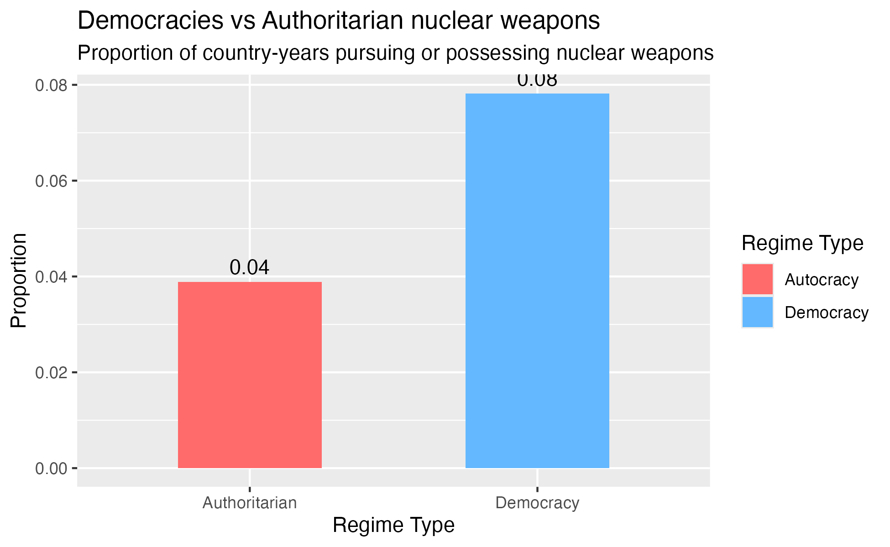

## Introduction 

This project examines whether authoritarian or democratic regimes are more likely to pursue nuclear weapons programs. It is important understand this relationship because nuclear proliferation, especially today, poses major risk internationally. Precarious leaders in charge of such countries may shape the world's most important defense decisions.

In an international system where the U.S. and Russia are head-to-head with their nuclear stockpile, democratic nations largely possess more nuclear arsenals in the post-Cold War landscape than authoritarian regimes all together. This is shaped by decades of competition, such as the Cuban Missile Crisis, and security concerns. However, China is now on the rise, expanding its arsenal faster than any other country. Meanwhile, several countries, including South Africa and Argentina, voluntarily gave up their nuclear pursuit in the 1990s, raising the question on whether regime type may determine nuclear capabilities. 

In general, democratic governments are more likely to be beholden to public accountability and legislative oversight, allowing more transparency, supervising and monitoring of activities the President conducts. These constraints can limit excessive military spending and raise the political cost of pursuing large nuclear arsenals. Conversely, authoritarian governments have fewer domestic constraints due to censorship (news accountability, take North Korea for example) or have a personalist dictator (Russia). A regime like this then may be able to leverage absolute  military power as a means to brand nuclear determination as regime survival. 

Therefore my research question is: 

Are democratic or authoritarian regimes more likely to pursue nuclear weapons programs?

#### Hypothesis:

Authoritarian countries are more likely than democratic countries to pursue nuclear weapons programs.

#### Variables 

This study uses cross-sectional time-series observational data.

My explanatory variable is regime type. This variable is measured by Our World Data on political regimes, which organizes countries on a scale of 0-3 to range autocracies and liberal democracies. I've recorded this into a binary variable where countries with values of 2 or higher are liberal democracies and are coded as 1, and autocracies are coded with values of 1 or lower as 0. 

My outcome variable is whether a country is pursuing a nuclear weapons program in a given year. This is measured using an Our World in Data dataset where:
0 = not considering; 1 = considering; 2 = pursuing; 3 = possessing

A pattern in the data that would support my hypothesis would be if autocratic countries, coded with a 0, are more likely to have a nuclear program than countries with a 1. My hypothesis will be disproved if democratic and authoritarian regimes pursue nuclear programs at similar rates, or if democratic countries are more likely to pursue nuclear weapons programs than authoritarian ones. 


## Data 

```{r, echo = F}
library(readr)
library(dplyr)
library(tidyverse)
```

```{r, echo = F}
nuclear_data <- read_csv("Data/country-position-nuclear-weapons.csv", show_col_types = FALSE) |>
  rename(nuclear_status = status) |>
  mutate(
    nuclear_program = ifelse(nuclear_status >= 2, 1, 0)
  )
knitr::kable(head(nuclear_data))
nuclear_data

```

```{r, echo = F}

freedom_data <- read_csv("Data/political-regime.csv")


knitr::kable(head(freedom_data))
freedom_data
```


#### Data cleaning 

```{r, echo = F}
freedom_data <- freedom_data |>
  rename(regime = regime_row_owid)


```

```{r, echo = F}
freedom_data <- freedom_data |>
  mutate(
    regime_binary = case_when(
      regime >= 2 ~ 1,   
      regime <= 1 ~ 0    
    ))

nuclear_data <- nuclear_data |>
  mutate(
    nuclear_program = ifelse(nuclear_status >= 2, 1, 0)
  )
```

```{r, echo = F}
combine_data <- freedom_data |>
  inner_join(nuclear_data, by = c("code", "year"))

```

## Results

#### Figure A Bar Plot 

```{r, echo = F}
plot_data <- combine_data |>
  group_by(regime_binary) |>
  summarize(
    prop_nuclear = mean(nuclear_program, na.rm = TRUE)
  )


bar <- ggplot(plot_data, aes(x = factor(regime_binary), y = prop_nuclear, fill = factor(regime_binary))) +
  geom_col(width = 0.5) +
  geom_text(aes(label = round(prop_nuclear, 2)), vjust = -0.5) +
  scale_x_discrete(labels = c("Authoritarian", "Democracy")) +
  scale_fill_manual(
    values = c("0" = "indianred1", "1" = "steelblue1"),
    labels = c("Autocracy", "Democracy"),
    name = "Regime Type"
  ) +
  labs(
    title = "Democracies vs Authoritarian nuclear weapons",
    subtitle = "Proportion of country-years pursuing or possessing nuclear weapons",
    x = "Regime Type",
    y = "Proportion"
  ) 

ggsave("bar.png", plot = bar)

```




This visualization serves as a broad overview. Each observation in the data sets represents a country in a specific year and the proportions in the graph reflect how often countries of each regime type have nuclear weapons across all observed years. Democratic countries show a higher proportion of weapons, sitting at 8%, compared to autocratic countries which are at 4%. Therefore, democratic regimes are about twice as likely as autocracies to pursue or possess nuclear weapons.


Note: Only 749 out of almost 21,000 countries have nuclear weapons, making the sample extremely low. Most countries never pursue nuclear weapons during most years. 


#### Figure B Time Trend Plot

```{r, echo = F}
overtime_data <- combine_data |>
  group_by(year, regime_binary) |>
  summarize(
    prop_nuclear = mean(nuclear_program, na.rm = TRUE)
  )

time_plot <- ggplot(overtime_data, aes(x = year, y = prop_nuclear, color = factor(regime_binary))) +
  geom_line() +
  scale_color_manual(
    values = c("0" = "indianred1", "1" = "steelblue1"),
    labels = c("Autocracy", "Democracy"), name = "Regime Type" ) +
  labs(
    title = "Nuclear weapons pursuit over Time by regime type",
    x = "Year",y = "Proportion Pursuing/Possessing")


ggsave("time_plot.png", plot = bar)
```



This visualization shows that democratic countries had a higher proportion of nuclear weapon programs from the 1940s to the 1960s where the proportion sits at nearly 20%. Because the data is structured by country-year, this means that about 20% of democratic country-year observations (or 1 in 5 democratic countries in a given year ) were pursuing or possessing nuclear weapons during this period. This pattern reflects the early nuclear development of countries such as the U.S., U.K., and France during and immediately after WWII.

This gap has changed however. From the 1970s onward, the proportion of democratic countries pursuing or possessing nuclear weapons slowed down, whereas authoritarian regimes steadily increased pursuit or possession. By the 1990s and 2000s, the two regime types overlap, and in some years following authoritarian regimes actually overcome democracies in nuclear possession or pursuit. This is likely due to the end of the Cold War where democracies stopped expanding and autocracies felt the need to now rely on deterrence including North Korea, Pakistan, and Iran.

Although democracies were historically more likely to develop nuclear weapons and may possess more today, autocracies have become more active in the nuclear-sphere. Therefore my initial interpretation is slightly incorrect. The reason why democracies appear more likely to possess or pursue nuclear weapons is driven by historical cases rather than a consistent pattern drawn into contemporary politics. The relationship between regime type and nuclear weapons program is not balanced and seems to depend more on time period.

#### Figure C Nuclear Weapon and Country Trajectory 

The next two visualizations 

```{r, echo = F}
selected_countries <- combine_data |>
  filter(entity.x %in% c(
    "China", "Iran", "North Korea", "United States","Russia","Iraq","Germany","United Kingdom", "France", "Argentina"
  ))

weapons_trajec <- ggplot(selected_countries, aes(x = year, y = nuclear_status, color = entity.x)) +
  geom_line(size = 1) +
  labs(
    title = "Nuclear Weapons Trajectories by Country",
    subtitle = "(0 = none, 3 = possession)",
    x = "Year",
    y = "Nuclear Status",
    color = "Country"
  )

ggsave("weapons_trajec.png", plot = weapons_trajec)
```


For this visualization, I picked three democracies that have nuclear weapons and two democracies (Germany and Japan) that could pursue a nuclear program but has not. Conversely, I chose five authoritarian countries. Russia, China, and North Korea all have a nuclear program; however, I picked Iran and Iraq because both of which have pursued or actively are pursuing a nuclear program more recently. Very early, the U.S., U.K., France, and Russia reached 3, or possession. China, North Korea, Iran, and Iraq show later nuclear trajectories in more of a contemporary era. 

Germany is especially interesting because after WWII the country went through a process of demilitarization and NATO dependence. Additionally, after the Fukushima 2011 nuclear meltdown disaster in Japan, their Chancellor Angela Merkel mandated a nuclear phase-out contributing to wary behind nuclear technology. Moreover, Argentina is very interesting since they considered pursuing nuclear weapons but stopped in the 1980s and 1990s due to a return to democracy and desire to create stability with Brazil. This shows how potentially having a nuclear weapons program can be seen as unstable and negative, another reason why democracies may be pursuing less weapons today while authoritarian countries feel the need to have them with less alliances.

Overall, pursuing nuclear weapons is not only regime type, or historical time period, but also political transitions or security incentives.  

Note: Reminder I've turned my data into binary variables where countries with values of 2 or higher are liberal democracies and are coded as 1, and autocracies are coded with values of 1 or lower as 0. My outcome variable, whether a country is pursuing a nuclear weapons program in a given yearm is measured where 0 = not considering; 1 = considering; 2 = pursuing; 3 = possessing. 

Let's take India and Pakistan for example. 

#### Figure D India and Pakistan Case

```{r, echo = F}
selected_countries <- combine_data |>
  filter(entity.x %in% c(
    "India", "Pakistan"
  ))

India_Pakistan <- ggplot(selected_countries, aes(x = year, y = nuclear_status, color = entity.x)) +
  geom_line(size = 1) +
  labs(
    title = "Nuclear Weapons Trajectories by Country",
    subtitle = "(0 = none, 3 = possession)",
    x = "Year",
    y = "Nuclear Status",
    color = "Country"
  )

ggsave("India_Pakistan.png", plot = bar)
```


India and Pakistan's nuclear arsenals were compiled much less because of regime type, but primarily because of regional competition. India's early pursuit was shaped by China's rise after the 1962 Sino-Indian War while Pakistan's accelerated in response to military humiliation like the 1971 war and border disputes with India. This shows the complexity behind the causal relationship between the outcome and explanatory variable. 

## Regression Analysis

#### Null hypothesis:

The coefficient on regime type of equal to zero, meaning there is no relationship between regime type and the likelihood of pursuing or possessing nuclear weapons.

#### Alternative hypothesis: 

The coefficient on regime type of not equal to zero, meaning there is a relationship between regime type and the likelihood of pursuing or possessing nuclear weapons. 


```{r, echo = F}
model1 <- lm(nuclear_program ~ regime_binary, data = combine_data)
confint(model1)
summary(model1)

knitr::kable(round(summary(model1)$coefficients, 3),
      col.names = c("Estimate", "Std. Error", "t value", "p-value"),
      caption = "Linear Regression: Effect of Regime Type on Nuclear Programs")

```


#### Intercept, Coefficient, P-Value, R sqaured 

The regression results estimate the relationship between regime type the likelihood of pursuing or possessing nuclear weapons. The intercept is about 0.039 which shows that autocratic countries have about a 3.9% probability of having a nuclear weapons program.

The coefficient on regime_binary is 0.039. This means that democratic countries are approximately 3.9 percentage points more likely to pursue or possess nuclear weapons compared to their counterparts. The coefficient has a standard error of 0.004. This means the estimate is fairly accurate.

This effect is statistically significant because the P-value is 0, illustrating that the relationship is highly unlikely to be due to random chance. This means the the null hypothesis is rejected and there is a relationship between regime type and nuclear weapons programs. The 95% confidence interval for the coefficient ranges from 0.032 to 0.047, which does not include 0 and supports my statistical significance. 

Although the effect is statistically significant, the effect is relatively small.
The R-squared value os 0.0068 shows that regime type alone only explains a small portion of variation in nuclear weapons development

Democratic countries are only slightly more likely than authoritarian regimes to pursue or possess nuclear weapons when averaged across all country-years.

#### Can we interpret this relationship as causal?

No, this relationship should not be interpreted as causal because this test relies on observational cross-sectional country-year data. There are other confounding factors such as regional rivalries, for instance between India and Pakistan, alliances like NATO, economic development, or historical periods that could influence both regime types and nuclear weapons behavior. This means I cannot say with certainty regime type itself directly causes countries to pursue nuclear weapons even if regime type is correlated with nuclear weapons programs. 

## Conclusion 

The results provide only partial support for my original hypothesis. While authoritarian regimes are not more likely than democracies to pursue nuclear weapons programs overall, the data suggests that authoritarian states have become increasingly more active in nuclear proliferation over time. Democratic countries historically dominated nuclear development, particularly during the Cold War which heavily influences the findings. Additionally, looking at specific countries, it is clear some countries may have been authoritarian while pursuing a weapon such as Argentina, but transitioned to a democracy. Or, authoritarian countries such as India or Pakistan, wanted to pursue weapons less because of their regime and more based on real wars happening at the time. This indicates that relationship between regime type and nuclear weapons program is shaped not only by domestic political institutions by also by historical context.

This project relies on observational country-year data, the findings should not be interpreted causally, and potentially confounding variables such as military threats, alliances, and economic power remain important limitations as discussed. Future research could improve this analysis by incorporating additional explanatory variables and focusing more directly on historical evolution in nuclear proliferation. 

Lastly, existing nuclear powers may no longer want to expand their arsenals at this time due to the Threat on the Non-Proliferation of Nuclear Weapons (NPT), mutual assured destruction, moratoriums, or other threats such as UN sanctions. Both the U.S. and Russia maintain large nuclear stockpiles but are constrained by the NPT and global deterrence structures. This stagnation among nuclear club powers may make newer nuclear pursuits by emerging authoritarian states such as Iran more important than aggregate possession rates alone. 


AI DISCLAIMER: 

For figure C, I used artificial intelligence to help design the ggplot, specifically helping me set up the entity.x variable and figuring out way to organize colors. Both datasets had a country-name column called "entity" and I joined them together. Entity.X is the country name from freedom_data or the left side of join. 

```{r print-code, ref.label=knitr::all_labels(), echo=TRUE, eval=FALSE}
```
